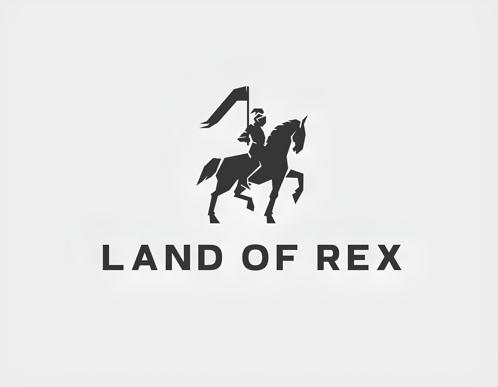
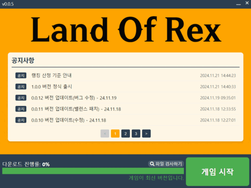
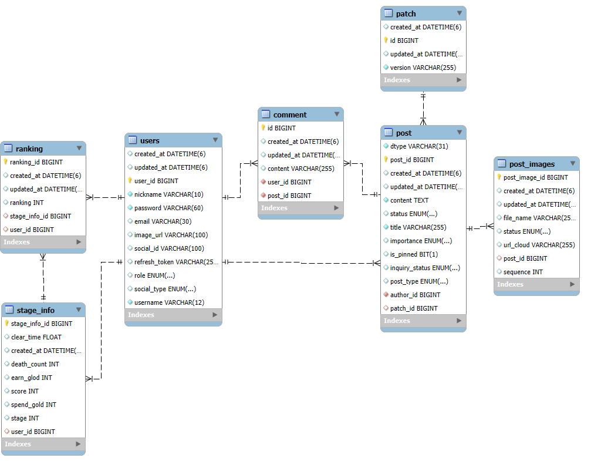

# 🎮 **Land Of Rex**

## 🕹️ 개요

팀명: **LOR**  
  서비스명: **Land Of Rex**  
  개발기간: **2024년 10월 14일 ~ 2024년 11월 19일**  

 

## 🏹 LOR - 팀원 소개
|                           |  |  | |       |                      |
| :-----------------------------------------------------------------------------------: | :----------------------------------------------------------: | :----------------------------------------------------------: | :------------------------------------------------------------------------------------: | :----------------------------------------------------------------------: | :------------------------------------------------------------------------------: |
|                                        윤지호                                         |                            김영수                            |                            박영훈                            |                                         손원륜                                         |                                  이형준                                  |                                      정유진                                      |
|                                  팀장 Game Client Launcher                                  |                         Game Client                          |                         Infra, CI/CD Backend                          |                                Game Client Frontend                                 |                     Game Client Backend                      |                            Game Client Frontend                             |
| 게임 런처 개발 게임 빌드 및 배포 게임 이펙트 및 사운드 |          게임 로직 구현 게임 로직 연결 및 통합           |        인프라 구축 BE(인증/인가, CRUD)        | GUI/UX 개발 FE 디자인 | 유닛, 건물 로직 구현 랭킹 시스템 구현 | FE 웹 페이지 연결 맵 디자인 |

   

## 🔋 서비스 소개
### 게임 런처 배포
게임 런처는 간편한 설치와 업데이트를 제공하는 서비스로, 게임 이용자에게 최상의 편리함을 제공합니다.  
사용자는 런처를 통해 손쉽게 게임을 설치하고 최신 버전으로 업데이트할 수 있으며, 게임 실행 기능도 제공합니다.  
특히 다운로드 진행 상황을 시각적으로 확인할 수 있는 진행 표시 바와 게임 공지사항 시스템을 통해 사용자 경험을 극대화했습니다.

### 게임 배경 소개하기
Land Of Rex는 중세 판타지 세계를 배경으로 나만의 영지를 건설하며 몰려오는 몬스터터로 부터 성을 지켜나갸야 합니다.

### 1인 디펜스 게임
본 게임은 1인 싱글 플레이를 기반으로 한 디펜스 게임으로, 성을 지키며 적의 공격을 막아내는 것이 주된 목표입니다. 
라운드마다 몰려오는 적을 물리치고 보상을 획득하여, 건물 업그레이드가 가능합니다. 
전략적인 플레이와 빠른 판단력으로 스테이지를 클리어 해보세요.

### 게임의 특색
* 유닛 배치와 전략성: 적들의 이동 경로를 분석해 유닛과 건물을 적절히 배치하는 것이 게임 승리의 핵심입니다.
* 성장 시스템: 몬스터를 처치하여 골드를 획득해 건물을 업그레이드 하거나, 더 많은 유닛을 소환하여 전술을 강화할 수 있습니다.
* 주/야간 전투 시스템: 낮에는 전투를 준비하고 방어 건축물을 설치하며, 밤에는 몬스터와 직접 전투를 펼칩니다.

### 랭킹
랭킹 시스템을 통해 플레이어의 경쟁심을 자극합니다.
* 랭킹 기준: 처치한 몬스터 수, 생존한 라운드 수, 게임 클리어 시간 등을 종합적으로 산출합니다.
* 리더보드 제공: 상위 랭커는 리더보드에 표시되며, 플레이어는 이를 통해 자신의 실력을 확인할 수 있습니다.

## ⚔️ 주요 기능

### 홈페이지

|                                           |                                         |
| ----------------------------------------- | --------------------------------------- |
|      |    |
| `웹 페이지` 웹 페이지 메인 화면           | `게임 다운로드` 웹 페이지 게임 다운로드 |

### 게임 런처

|                                           |                                         |
| ----------------------------------------- | --------------------------------------- |
|      |    |
| `게임 런처` 게임 런처 메인           | `게임 다운로드` 런처 게임 다운로드 |
|      |    |
| `게임 업데이트` 게임 업데이트 확인           | `게임 업데이트` 게임 업데이트 다운로드 |
|      |    |
| `파일 검사하기` 게임 파일 검사           | `공지사항` 공지사항 확인 |

### 게임 플레이

|                                           |                                         |
| ----------------------------------------- | --------------------------------------- |
|  |    |
| 게임실행(게임런처)           | 게임접속, 로그인 |
|  |    |
| 로비, 스테이지 접속           | 이동, 건물 짓기 |
|  |    |
| 병영건설          | 몬스터웨이브, 몬스터처치 |
|  |    |
| 지형지물 활용           | 스테이지 클리어 |

### 랭킹

|                                           |                                         |
| ----------------------------------------- | --------------------------------------- |
|      |    |
| `웹 페이지` 웹 페이지 메인 화면           | `게임 다운로드` 웹 페이지 게임 다운로드 |

 

## ⚙️ 사용 기술

### **게임 런처**

### **FE**

### **BE**

### **INFRA**

### **모니터링**

### **Game**

### **협업**

 

## 🗄️ ERD

## 📒 프로젝트 기록
[Notion 협업링크](https://oval-dodo-b77.notion.site/E102-11fdf4eec30280f18fd9fe328a0ca17f?pvs=4)

## 🎨 와이어 프레임
[Figma 링크](https://www.figma.com/design/9MbhoiVHDfmFhzG5Ibmjok/%EB%94%94%ED%8E%9C%EC%8A%A4-%EA%B2%8C%EC%9E%84?t=B0gUzqpYPm0p053Q-1)
[Figma 링크2](https://www.figma.com/design/mrw6CKBeZo7pXfFO9Xzgt0/Untitled?node-id=0-1&node-type=canvas&t=BQkGtvYe4VWJXEup-0)

